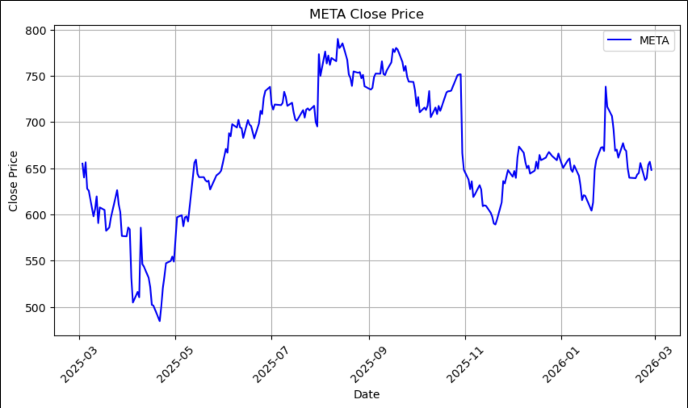
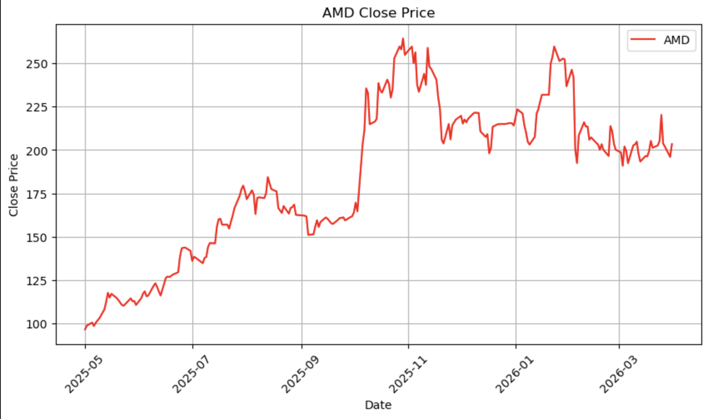
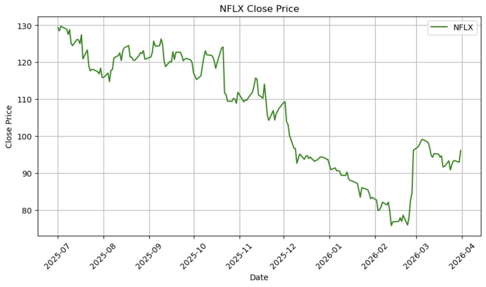
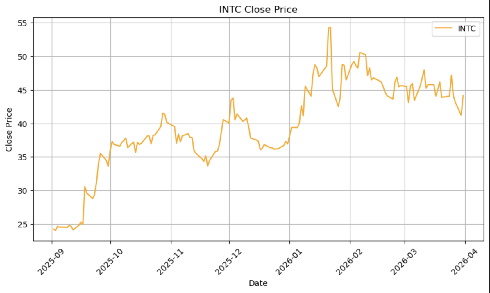
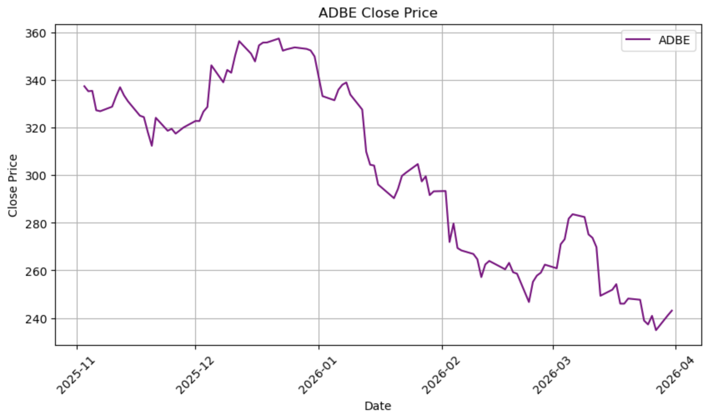

# DATA CARD – NASDAQ STOCK DATASET

## 1. Source of Data

The dataset was collected using the Yahoo Finance API via the Python library *yfinance*. The selected companies include META (Meta), AMD (Advanced Micro Devices), NFLX (Netflix), INTC (Intel), and ADBE (Adobe).

The data consists of daily closing stock prices (Close price). The dataset is stored in individual CSV files for each company, as well as in one combined dataset containing all companies. The time range of the data spans from March 3, 2025 to March 31, 2026.

| Ticker | Company | Start Date | End Date |
|--------|---------|------------|------------|
| META   | Meta    | 2025-03-01 | 2026-03-01 |
| AMD    | AMD     | 2025-05-01 | 2026-04-01 |
| NFLX   | Netflix | 2025-07-01 | 2026-04-01 |
| INTC   | Intel   | 2025-09-01 | 2026-04-01 |
| ADBE   | Adobe   | 2025-11-01 | 2026-04-01 |

## 2. Dataset Structure

The dataset contains a total of 917 observations. It includes the following columns: Date (datetime64), Ticker (string), Company (string), and Close (float). 

## 3. KPI Analysis

### Completeness

The dataset was checked for missing values across all columns. No missing values were found in Date, Ticker, Company, or Close. The total number of missing values is 0, which corresponds to 0.0% missing data.

Therefore, the dataset is fully complete.

### Latency

The dataset covers the period from March 3, 2025 to March 31, 2026. Each company has data collected over a different time interval, ensuring variation in the dataset.

The data represents recent historical stock prices obtained from Yahoo Finance, which ensures low latency and relevance of the dataset.

### Accuracy

Several validation checks were performed to ensure data accuracy. No negative or non-numeric values were detected in the Close price column. All values fall within realistic market ranges.

Descriptive statistics confirm this:
The dataset includes 917 observations, with a mean value of 290.28 and a standard deviation of 246.37. The minimum value is 24.00, and the maximum value is 790.00.

Additionally, no extreme outliers or unrealistic values were detected.

Thus, the dataset is considered accurate and reliable.

### Consistency

The dataset structure is uniform across all observations. All rows are non-null, and the data types are consistent: Date is stored as datetime64, Ticker and Company as strings, and Close as float64.

No duplicate rows were found.

Therefore, the dataset is fully consistent.

## 4. Descriptive Statistics (Per Company)

For META, the dataset contains 250 observations with a mean value of 668.15 and a standard deviation of 67.55. The stock shows relatively high volatility, with prices reaching a maximum of approximately 790, followed by a noticeable decline. The overall behavior reflects repeated cycles of growth and correction.

For AMD, the dataset includes 230 observations with a mean of 184.97 and a standard deviation of 43.73. The stock demonstrates a clear upward trend from around 100 to over 260, followed by a period of stabilization, indicating strong growth dynamics.

For NFLX, there are 189 observations with a mean of 106.28 and a standard deviation of 15.60. The stock initially declines to around 75–80 and then recovers, showing moderate volatility and a pattern of downturn followed by rebound.

For INTC, the dataset includes 146 observations with a mean of 39.69 and a standard deviation of 6.79. The stock remains relatively stable, with small fluctuations and a pattern of gradual growth followed by sideways movement, indicating low volatility.

For ADBE, the dataset contains 102 observations with a mean of 301.20 and a standard deviation of 37.96. The stock initially increases to above 350, then experiences a sharp decline to around 240, followed by partial recovery, reflecting a peak-and-drop pattern.

## 5. Overall Graph Analysis

Across all companies, different market behaviors can be observed. AMD demonstrates strong growth, META shows cycles of volatility, NFLX exhibits decline followed by recovery, INTC remains relatively stable, and ADBE displays a peak followed by a significant drop.

These patterns indicate that the dataset reflects realistic market dynamics, including trends, volatility, and corrections.

## 6. Final Conclusion

The dataset satisfies all key performance indicators. It is fully complete with no missing values, demonstrates low latency due to recent data, maintains high accuracy with valid and realistic values, and is fully consistent with a clean and uniform structure.

Overall, the dataset is high-quality, reliable, and suitable for financial analysis, forecasting, and machine learning applications.

## Code

The data collection and analysis were performed using Python.  
The code is available in the repository file `KPI NASDAQ analysis.ipynb`.

